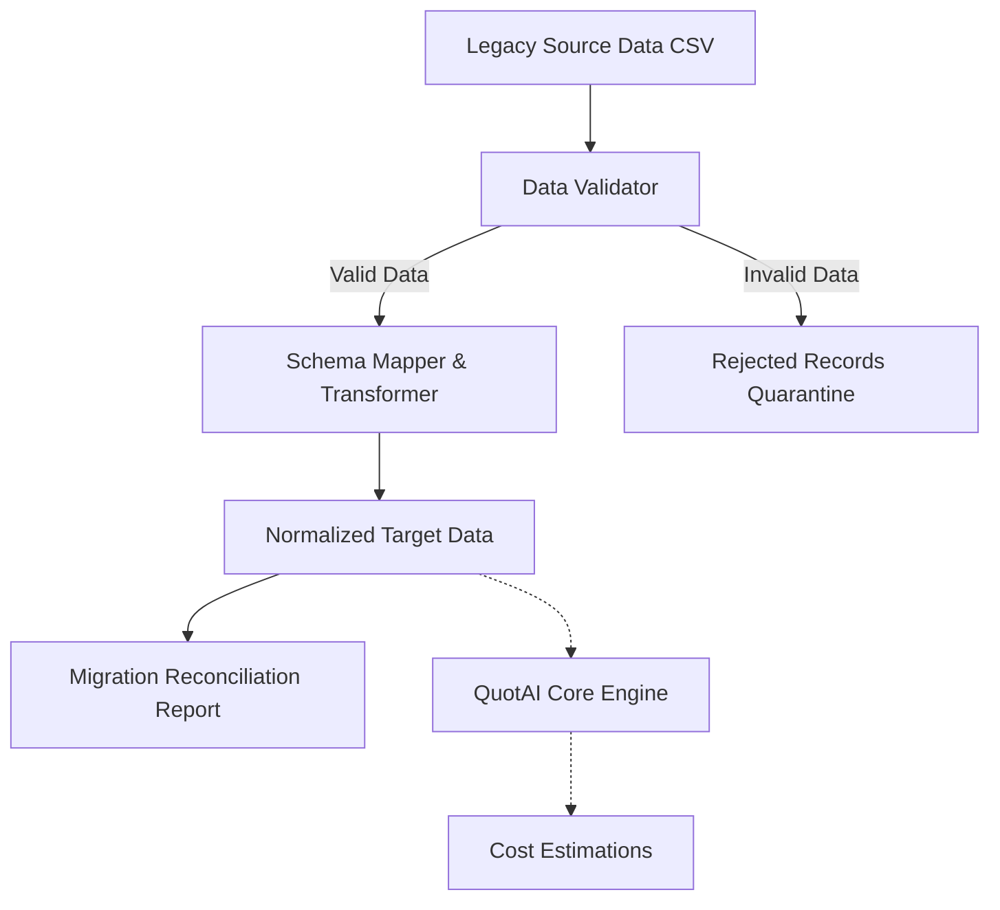

# QuotAI Data Migration & ETL Pipeline

QuotAI is a modular, ETL-style data migration and processing pipeline built in Python. Originally conceived for variant-based cost estimation, its architecture focuses heavily on strict data validation, schema mapping, transformation, and reconciliation, making it a robust template for structured legacy data migrations.

This repository demonstrates how to build a clean, testable, and idempotent data pipeline using standard Python libraries, without relying on heavy distributed frameworks (e.g., Spark, Kafka) where local or batch processing is sufficient.

## Architecture & Data Flow



## Key Features

1. **Validation Layer**: Implements strict structural and referential integrity checks. Identifies missing, null, duplicate, and malformed reference data before it can corrupt the target system.
2. **Schema Mapping & Transformation**: Explicitly maps legacy, denormalized schemas to normalized target structures using defined business rules.
3. **Data Quarantine**: Invalid records do not cause silent failures or abort the pipeline. They are safely routed to a rejected records log (`rejected_records.csv`) alongside specific, actionable error messages.
4. **Automated Reconciliation**: Generates a deterministic JSON report comparing source record counts against valid/invalid and migrated target counts to mathematically prove data integrity.
5. **Idempotency**: The pipeline is designed to be fully idempotent. Running the migration multiple times with the same inputs will not result in duplicated target records.
6. **Extensible CLI**: Driven by a clean Command Line Interface utilizing built-in Python `argparse` for easy automation and integration.

## Project Structure

```
quotai/
├── data/       # Data loaders and sink adapters
├── engine/     # Core estimation business logic
├── migration/  # Quarantine logs and reconciliation strategies
├── pipeline/   # Orchestration, schema mapping, and transformations
├── reports/    # Reporting outputs (migration_report.json)
├── tests/      # Comprehensive pytest suite
├── utils/      # Utility helpers (logging, configurations)
├── validation/ # Schema validators and referential integrity checks
├── cli.py      # Command-line interface definition
└── __main__.py # Entry point for Python execution
```

## Validation Rules

Before legacy data reaches the transformation phase, it is validated for structural and referential integrity:
- Non-nullable fields cannot be empty.
- Fields must conform to their expected schema types (e.g., Decimal, String).
- Foreign Key relationships (e.g., validating legacy Material IDs against known Master Data).

## Source → Target Mapping

Legacy schema formats are often flat and denormalized. The pipeline uses explicit mappings in `quotai/pipeline/schema.py` and `quotai/pipeline/transformer.py` to transpose, clean, and normalize this data to cleanly match the target architecture's models.

## Migration Example

The primary engineering interface for executing the data migration is our automated CLI.

```bash
python -m quotai migrate \
    --source sample_data/legacy \
    --target output/migrated \
    --report output/reports/migration_report.json
```

**Execution Flow:**
- **Extracts** legacy data from `sample_data/legacy`.
- **Transforms & Loads** cleaned, normalized data into `output/migrated/`.
- **Quarantines** records failing validation into `output/rejected/rejected_records.csv`.
- **Reconciles** the migration in a final summary report at `output/reports/migration_report.json`.

## Reconciliation

At the end of the migration run, the orchestrator counts the processed rows to guarantee zero data loss. The formula is:
`Source Records = Valid Records + Rejected Records`

A deterministic JSON report is written summarizing these counts and marking `reconciliation_pass: true` for full transparency. 

## Idempotency

The ETL pipeline guarantees idempotency. When re-running the migration over previously migrated legacy files, it safely merges or deduplicates existing records in the target state. Data is never doubled or corrupted on retry.

## Testing

The project features a highly categorized and comprehensive `pytest` suite ensuring all rules work exactly as expected:
- `test_validation.py`: Data-quality rules
- `test_pipeline.py`: Transformation pipeline mapping logic
- `test_migration.py`: Reconciliation and quarantine flows
- `test_cli.py`: Engineering interface execution
- `test_estimator.py`: Core domain logic

```bash
python -m pytest quotai/tests -v
```

## CI

This repository is ready to be hooked into any standard Continuous Integration workflow using GitHub Actions. It supports automated PR checks for linting, typings, and `pytest` enforcement, keeping the `main` branch reliably stable.

## Limitations

- **File-Based State:** Because this is a prototype, CSV files simulate both the source and target storage adapters. For a production implementation, the file adapters would be replaced with SQL-based Extraction and Loading adapters while retaining the exact same validation, transformation, and reconciliation principles.

## Setup & Installation

```bash
# Clone the repository
git clone https://github.com/Dhanas3kar/quotai_sample_data.git
cd quotai_sample_data

# Set up a virtual environment
python -m venv venv
source venv/bin/activate  # On Windows: venv\Scripts\activate

# Install dependencies
pip install -r requirements.txt
```

## Project Documentation
- **[MIGRATION_DESIGN.md](MIGRATION_DESIGN.md)**: A detailed technical breakdown of the validation logic, schema mapping, and transformation rules governing the pipeline.
