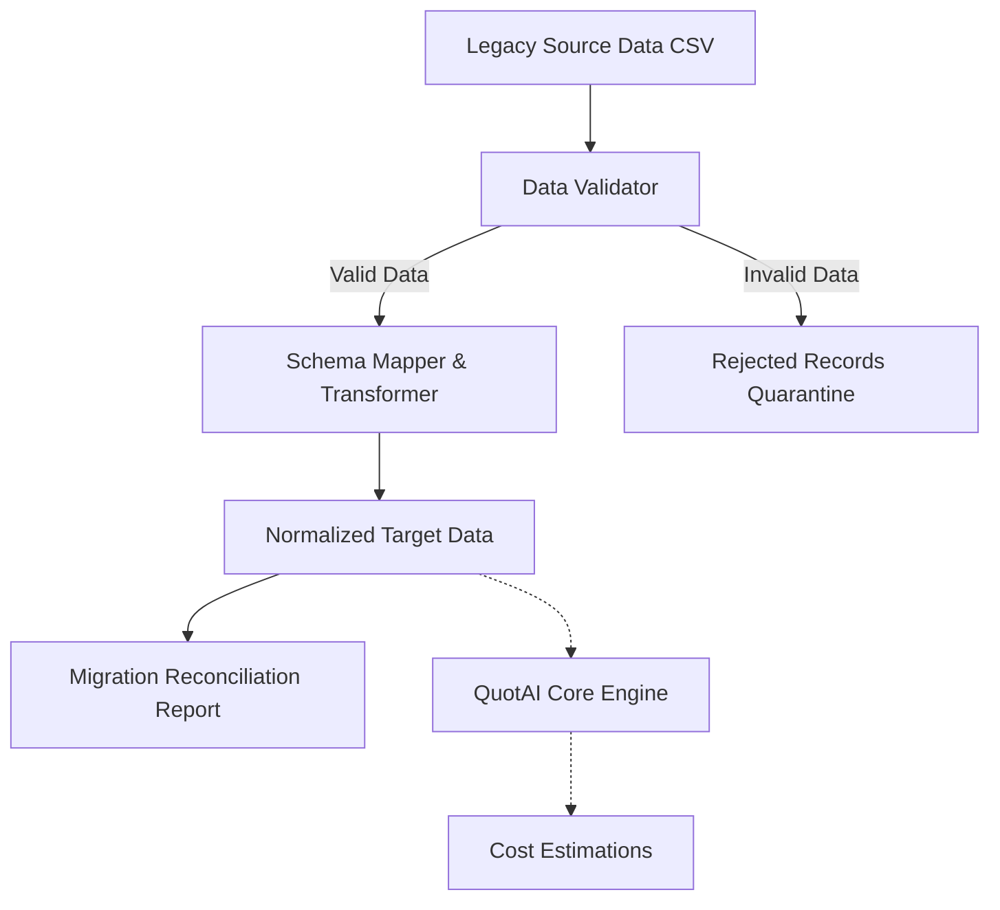

# QuotAI - Data Processing & Migration Simulation

QuotAI is a modular Python prototype originally designed for cost-estimation logic. It has been extended with an ETL-style validation and transformation pipeline to simulate migrating structured legacy CSV data into a normalized target format.

**Disclaimer**: This is a prototype and data-processing simulation, not a production enterprise banking migration platform. It demonstrates schema mapping, validation, error quarantine, and idempotency using a simplified mechanical cost estimation domain.

## Architecture & Data Flow



## Features

1. **Validation Layer**: Identifies missing, null, duplicate, and invalid reference data.
2. **Schema Mapping**: Explicitly maps legacy schemas to target normalized schemas.
3. **Error Quarantine**: Instead of silently failing, invalid records are outputted to a rejected record log with explicit error messaging.
4. **Reconciliation**: Generates a JSON report comparing source records, valid/invalid counts, and target counts.
5. **Idempotency**: Running the migration twice with the same inputs will not duplicate the target output records.
6. **Command Line Interface (CLI)**: Automate processing using standard Python commands.

## Setup & Installation

```bash
# Clone the repository
git clone https://github.com/Dhanas3kar/quotai_sample_data.git
cd quotai_sample_data

# Set up virtual environment (optional but recommended)
python -m venv venv
source venv/bin/activate  # On Windows: venv\Scripts\activate

# Install dependencies
pip install -r requirements.txt
```

## Running the Pipeline

### Migration Command
The primary engineering interface for data migration.

```bash
python -m quotai migrate \
    --source sample_data/legacy \
    --target output/migrated \
    --report output/reports/migration_report.json
```

This will:
- Read legacy data from `sample_data/legacy`
- Write cleaned data to `output/migrated`
- Quarantine bad data into `output/rejected/rejected_records.csv`
- Produce a summary report at `output/reports/migration_report.json`

### Run Tests
```bash
python -m pytest quotai/tests
```

## Project Documentation
- **MIGRATION_DESIGN.md**: Detailed breakdown of the validation and transformation rules.
